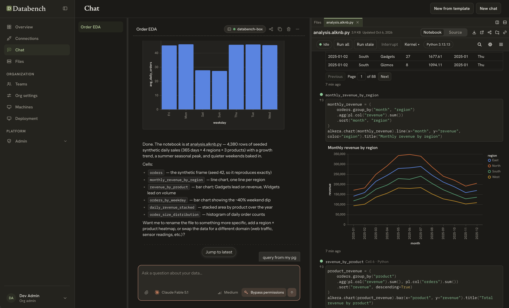

# Databench by Alkera

Databench by [Alkera](https://alkera.ai) is a self-hostable, fully web-based workspace where people and agents work on data together. It gives a team shared files, notebooks, agent chats and compute on infrastructure you control.

[Alkera](https://alkera.ai) is the full commercial offering, with many more features and a generous free tier.



What is in this repository:

- **Notebooks for SQL, Python and agents together.** One notebook mixes SQL and Python cells. A SQL cell queries any of your connections and hands its result to the Python cells as a dataframe. Agents read, write and run cells alongside you, live, and you see their edits as they make them. Notebooks are plain Python files, compatible with marimo, with tables and charts drawn inline.
- **Organisations and access.** Password sign-in, organisations, nested teams, invitations, roles, and one authorization policy layer that records every decision.
- **Files.** A shared drive per organisation with live editing, sharing and trash.
- **Agent chats.** An agent runs each chat in a sandbox on a machine you choose, through a model gateway that uses your own provider keys. The agent harness is one contract, `HarnessAdapter`, with two implementations: [opencode](https://github.com/sst/opencode) (vendored, MIT, the default) and Claude Agent SDK (work in progress).
- **Workspaces and compute.** Machines from a local Docker box or any server you reach over SSH, placed and shared per team.
- **Clients.** A web app, and a CLI (`alkera`) with a local daemon.

Licensed under Apache-2.0. See [LICENSE](LICENSE) and [NOTICE](NOTICE).

## Try it on one machine

You need Docker with Compose v2 and an Anthropic or OpenAI API key.

```bash
git clone https://github.com/AlkeraAI/Databench.git
cd Databench
cp .env.example .env
```

Put your key in `.env` (`ANTHROPIC_API_KEY=` or `OPENAI_API_KEY=`, the first settings in the file), then start it:

```bash
docker compose up --build
```

The first run builds the images, which takes a while. Open `http://localhost:8080` and sign in as `admin@example.com` with the password `admin`. Start a chat: the stack includes a box, the machine chats run on, and it registers itself, so there is nothing else to set up. Email the app sends lands in Mailpit at `http://localhost:8025`.

This stack runs with development secrets and every port bound to `127.0.0.1`. Use it only on your own machine. A data connection can reach any host the box can, including this computer as `host.docker.internal`.

## Deploy it for a team

A deployment other people reach uses `deploy/docker/compose.prod.example.yml`, which refuses to start without real secrets. [deploy/INSTALL.md](deploy/INSTALL.md) is the full guide. In short:

```bash
make docker-images IMAGE_VERSION=dev
cat > .env <<'EOF'
APP_VERSION=dev
PUBLIC_BASE_URL=https://databench.example.com
FILES_CONTENT_BASE_URL=https://files.databench-content.example
DB_PASSWORD=<random>
TEMPORAL_DB_PASSWORD=<a different random value>
EMAIL_ENABLED=false
ANTHROPIC_API_KEY=<your key>
EOF
prod() { docker compose -f deploy/docker/compose.prod.example.yml --env-file .env "$@"; }
prod up -d
ADMIN_BOOTSTRAP_EMAIL=you@example.com ADMIN_BOOTSTRAP_ORG_NAME="Example" \
  prod --profile bootstrap run --rm bootstrap
```

Point both hostnames at the `web` container (port 80) through your TLS proxy. The bootstrap prints the first admin's password. Chats then run on machines an organisation admin adds over SSH.

## Add a machine over SSH

Chats and notebooks run on machines. Besides the box the one-machine stack starts, an organisation admin can add any Linux server they reach over SSH, and Databench installs its node on it.

### What the server needs

- Linux with systemd, on x86_64 or arm64.
- A user that is root or can use sudo without a password, signed in with a password or a private key.
- Network reach both ways. Databench connects to the server on its SSH port, and the node on the server calls Databench back at `ALKERA_NODE_API_URL` (by default `PUBLIC_BASE_URL`), at the model gateway under `/gateway` on the same address, and at `FILES_CONTENT_BASE_URL`. The one-machine stack listens on `127.0.0.1` only, so a server elsewhere needs an address it can reach, such as a tunnel to port 8080, set as `ALKERA_NODE_API_URL` in `.env`.
- Docker is optional. A server that already runs Docker containers keeps running them.

The images carry the node for the architecture they were built on. To add a server of the other kind, such as an x86_64 server from images built on an Apple-silicon Mac, build them with `NODE_BUNDLE_ARCHES=all` (or `amd64` or `arm64`), as [deploy/INSTALL.md](deploy/INSTALL.md) explains.

### Add it

1. Open Organization, then Machines, and choose Add machine.
2. Give it a name, the host and SSH port, the username, and a private key or password.
3. Choose Test connection. It shows the host's system, size and SSH host key, and lists anything the host lacks.
4. Check that the host key matches the server, choose who can use the machine, and choose Add machine.

The machine reads Running once its node has installed and registered, which takes a few minutes. Move a workspace onto it to run its chats there.

### What it changes on the server

- Packages it needs (nftables, uidmap, acl, iproute2, quota and a few more), and gVisor (`runsc`) to sandbox every chat.
- uv and micromamba in `/usr/local/bin`, its Python, the chats' root filesystem and the node itself under `/opt/alkera`, settings in `/etc/alkera`, and chat data in `/opt/alkera-work`.
- The `alkera-node` systemd service, and subordinate id ranges for root in `/etc/subuid` and `/etc/subgid`.
- An nftables table, `inet alkera_sandbox`, loaded at boot through `/etc/nftables.conf`. On a server added over SSH it filters only the node's own network links (`vc*` and `vo*`) and chat users, and leaves every other service and container alone.
- On a server that runs Docker, rules in Docker's `DOCKER-USER` chain that let the node's links through Docker's forward policy. They carry the comment `alkera-sandbox`, and the node puts them back if Docker starts or restarts later.
- IP forwarding, persisted in `/etc/sysctl.d/90-alkera-sandbox.conf`.

Removing the machine stops and removes the service, deletes the `alkera_sandbox` table and its line in `/etc/nftables.conf`, the `DOCKER-USER` rules and the sysctl file, and deletes `/opt/alkera`, `/opt/alkera-home` and `/etc/alkera`. It leaves the packages, gVisor, uv, micromamba, the id ranges and the chat data in `/opt/alkera-work`. Forwarding stays on until the next reboot.

### Known limits

- Chats use the network `10.200.0.0/14`. Test connection refuses a server that reaches Databench at an address inside it.
- A Docker using its nftables firewall (`firewall-backend: nftables`) has no `DOCKER-USER` chain and needs no rule. The node logs once what to allow should its links still be blocked.
- ufw and firewalld are not handled yet. Both drop forwarded traffic by default, so on such a server the node's links stay blocked until you allow `vo+` and `vc+` yourself.

## Developing

Requirements are macOS or Linux, Python 3.13 with [uv](https://docs.astral.sh/uv/), Node 20 with pnpm, and Docker. Windows is supported for the CLI and daemon.

```bash
make bootstrap     # uv sync, pnpm install, .env from .env.example
make infra-up      # Postgres, Temporal, Mailpit and SeaweedFS in Docker
make migrate       # apply the database migrations
make seed          # a local admin (admin@example.com / admin)
make dev-all       # backend, worker, gateway and web app together
make urls          # the local URLs
```

Put a provider key in `.env` to chat. `make test`, `make lint` and `make typecheck` run the checks; run them before you push. [AGENTS.md](AGENTS.md) is the working guide for this repository, for people and agents alike.

## Architecture

```
            browser                                 alkera CLI
               |                                         |
               |                                    alkera serve   (local daemon, JSON-RPC over stdio)
               v                                         |
        web (nginx, SPA) --------------------------------+
               |
               v
        backend (FastAPI) ----- Postgres (app data, Files metadata)
          |        |      \____ S3-compatible store (Files content)
          |        |
          |        +------------ Temporal ----- worker (background jobs, schedules)
          |
          +-- compute providers (local Docker box, SSH machines)
                 |
                 v
          box: supervisor, per-chat sandbox, agent harness, notebook kernel
                 |
                 v
        gateway (FastAPI) ----- Anthropic, OpenAI, Bedrock (your keys)
```

| Directory | What it holds |
| --- | --- |
| `apps/backend` | The HTTP API. Routes parse the request, call one service, and shape the response. Services hold the logic. |
| `apps/worker` | Temporal workflows and activities, one per background job, on four task queues. |
| `apps/model-gateway` | The LLM gateway: provider codecs, routing and streaming. Metering sits behind a port. |
| `apps/cli` | The `alkera` CLI, the local daemon, the agent harness and the box supervisor. |
| `apps/web` | The React web app. |
| `packages/api-core` | `alkera_core`: settings, database, ORM models, schemas, authorization, Files, compute, email. Shared by every Python process. |
| `packages/alkera-notebook`, `packages/alkera-kernel`, `packages/alkera-py` | The notebook format, the kernel, and the `alkera` Python API used inside notebooks. |
| `packages/ui`, `packages/chat-model`, `packages/notebook-ui`, `packages/widgets`, `packages/chart-guard` | Shared React UI, the chat conversation model, and notebook rendering. |
| `packages/py-sdk`, `packages/ts-sdk`, `packages/shared-openapi` | Typed API clients generated from the OpenAPI document. |
| `vendor/marimo`, `vendor/opencode` | Vendored upstream projects with their own licences. See [NOTICE](NOTICE). |

### Extension points

Behaviour that a deployment adds, such as another router, a background job family, a compute provider or a CLI plugin, registers through an `ExtensionPoint` in `alkera_core.extensions`. A point is ordered, refuses duplicates and freezes on first read. Every point has a default, and the open build boots and passes its tests with nothing registered.

## Contributing

See [CONTRIBUTING.md](CONTRIBUTING.md). Contributions are accepted under the Developer Certificate of Origin. Report security problems as described in [SECURITY.md](SECURITY.md), not in a public issue.

## Trademarks

The code is Apache-2.0. The names and logos are not licensed with it. See [TRADEMARKS.md](TRADEMARKS.md).
